# Locks, Actors, And Stm In Pictures
> 翻译自[这里](http://www.adit.io/posts/2013-05-15-Locks,-Actors,-And-STM-In-Pictures.html)

所有的并发程序都有相同的问题
你的程序使用内存

当你的代码是单线程的，只有一个线程来访问你的内存，这是没问题的。

但是当你的代码是多线程的，它们就会相互改写变化的内容。

你有三种方法来解决这个问题
1. lock
2. actor
3. software transaction memory
我会用这三种方法来解决一个经典的并发问题，并且看一下哪个是最好的.我要解决哲学家吃饭问题。如果你不知道这个问题，来看一下[这部分](http://www.adit.io/posts/2013-05-11-The-Dining-Philosophers-Problem-With-Ron-Swanson.html)。
## lock
如果你的代码访问一块内存，那就把这块内存锁起来。

**mutex** == the lock
**critical section** == the code locked with the mutex
现在，如果有线程想要访问这份代码的话，它必须要有钥匙.所以同一时间只有一个线程可以访问这段代码。
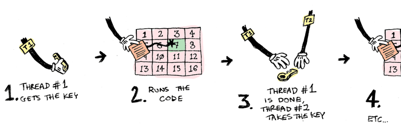
很好，在一个时刻只有一个线程访问某段代码。问题解决了，是吗？
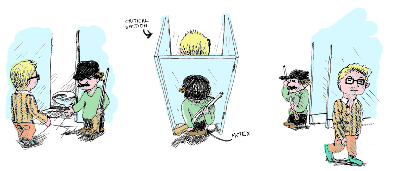

下面是关于[资源继承解决方法](http://www.adit.io/posts/2013-05-11-The-Dining-Philosophers-Problem-With-Ron-Swanson.html#solution-1-resource-hierarchy的Rudy代码的实现。每一个哲学家都有左叉子和右叉子（两个都是mutex）。
```
class Philosopher
    def initialize(name, left_fork, right_fork)
        @name=name
        @left_fork=left_fork
        @right_fork=right_fork
    end
```

现在我们试着获取叉子
```
while true
    @left_fork.lock
    puts "Philosophor #@name has one fork..."
    if @right_fork.try_lock
        break
    else
        puts "Philosopher #@name cannot pickup second fork"
        @left_fork.unlock
    end
end
```
1. 一个哲学家拿起了叉子1.他等着直到他拥有它（'''lock''' 等待）
2. 他试着拿起叉子2，但是他没有等待（'''try_lock''' 不等待）
3. 如果他没有得到叉子2，他放下叉子1并再次尝试
[完整的代码在这](https://gist.github.com/egonSchiele/5565009)。[这里有一份使用服务员的代码实现](https://gist.github.com/egonSchiele/5593864)
锁使用起来很有技巧。如果你使用了锁，做好准备处理各种各样的因为死锁饿死而带来的bug。[这篇文章讨论了所有你可能碰到的问题](http://www.adit.io/posts/2013-05-11-The-Dining-Philosophers-Problem-With-Ron-Swanson.html)

## Actors
我爱actors，你爱actors。Actors是独身且忧郁的。每个actor管理自己的状态。

actors相互之间的请求通过消息传递。
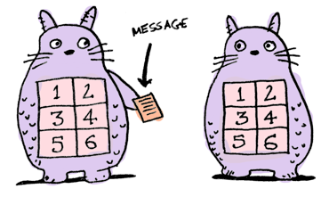
**actors从来不分享状态，所以他们永远也不需要通过竞争锁来获取共享的数据。**如果actor永不阻塞，你永远不会死锁！actors在线程间从不共享，所以只有一个线程能获取这个actor的状态。
当你传递消息给一个actor，这个消息就会进入它的邮箱。actor一次从邮箱里拿出一个消息来读。
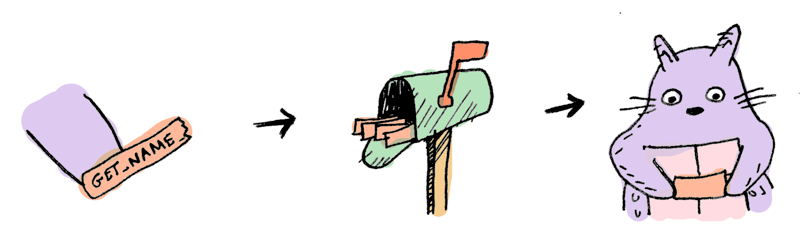
对于Rudy，我最喜欢的actor库是[Celluloid](https://github.com/celluloid/celluloid).这里是用Celluloid实现了一个简易的actor.
```
class Dog
    include Celluloid
        @name=name
    end

    def get_name
        @name
    end
end
```
看一下```include Celluoid```?这就是它所带来的，将每个```Dog```变成actor.
```
> d = Dog.new
 => #<Celluloid::ActorProxy(Dog:0x3fe988c0d60c)>
> d.set_name "snowy"
 => "snowy"
```
这里我们同步的将actor```d```的名字设为"snowy"。然后我们通过传递消息异步的设置它的名字：
```
d.async.set_name "snoopy"
 => nil
d.get_name
 => "snoopy"

```
相当不错。为了解决哲学家吃饭问题。我们需要使用一个actor来建模共享状态。所以我们引入```Waiter```:
```
class Waiter
  include Celluloid
  FORK_FREE = 0
  FORK_USED = 1

  def initialize(forks)
    @philosophers = []
    @eating = []
    @forks = [FORK_FREE, FORK_FREE, FORK_FREE, FORK_FREE, FORK_FREE]
  end
end
```
这个Waiter掌管着叉子：
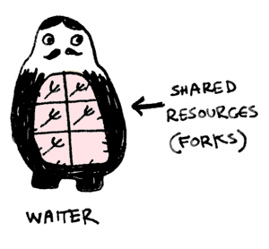

当一个哲学家饿了，他通过传送消息告知Waiter：
```
def think
    puts "#{name} is thinking"
    sleep(rand)
    puts "#{name} gets hungry"
    waiter.async.hungry(Actor.current)
end
```

当这个waiter得了消息，他会查看是否有叉子是可用的。
<ul type="cycle">
    <li>如果有可用的叉子，waiter会将他们标记为“in use”，并且给哲学家发送可以吃的消息</li>
    <li>如果没有叉子可用，waiter会告诉哲学家继续思考</li>
</ul>
```
def hungry(philosopher)
    pos=@philosopher.index(philosopher)
    leftpos = pos
    rightpos=(pos+1)%@forks.size
    if @fork[leftpos]==FORKFREE && @forks[rightpos] == FORKFREE
        @forks[leftpos] =FORKUSED
        @eating<<philosopher
        philosopher.aync.eat
    else
        philosopher.asyn.think
    end
end
```
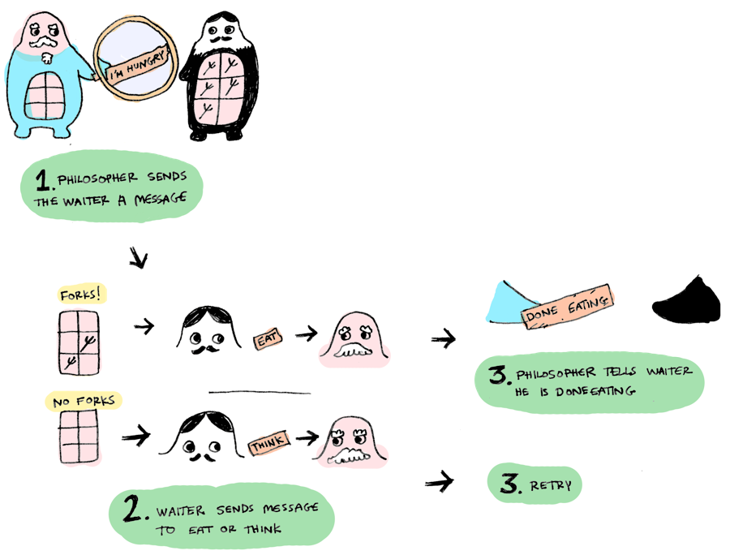

[完整的代码在这里]()。如果你想知道使用锁是怎么做的，[请看这里]().
共享的状态是叉子，只有一个线程在管理这个状态。问题解决了，多谢actors。


## Software Transactional Memory
这一节我要使用Haskell，因为它对STM的实现很好。
STM的使用很简单。就像是数据库中的事物。例如，你通过不可再分的操作拿起两把叉子
```
atomically $ do
    leftFork<- takeFork left
    rightFork<- takeFork right
```
就是这样的，不需要涉及锁和消息传递。这就是STM工作的方式：
1. 你定义一个变量来包含共享状态。在Haskell中这个变量叫做```TVar```：

你可以使用```writeVar```来对这个变量进行写操作，也可以使用```readTVar```来对这个变量进行写操作。一个事物处理写和读操作```TVar```
1. 当一个事物正在一个线程中运行，Haskell只为这个线程创建一个事物日志

2. 当一个共享内存块被写（使用write
TVar）,TVar的地址和它的新值被写入**日志中**，而不是它本身：
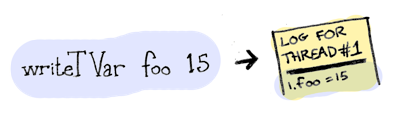
无论何时一个共享的内存块被读（使用readTvar）：
<ul type="circle">
    <li>首先，这个线程会在日志中寻找这个值（以防这个值先前被writeTVar使用而写入值）。</li>
    <li>如果什么都没有被发现，**然后**这个值被从TVar中读取出来，并且TVar和这个被读的值会被记录在日志中。</li>
</ul>

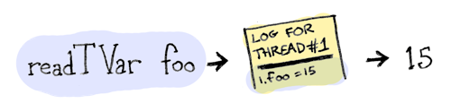
同时，其他的线程能够运行它们自己的不可再分的代码块，并且修改这个同样的TVar。
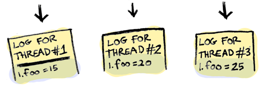
当不可再分的代码块结束运行，日志得到验证。验证过程是这样的，我们检查在日中的每一个readTVar，确保它匹配了实际的TVar。如果它匹配了，这个验证就成功了。然后我们将从事物日志中得到的新的值写入TVar。
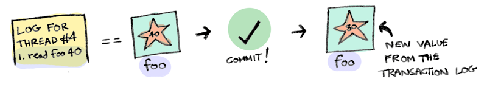

如果验证失败了，我们删除事物日志并且再次运行代码块。
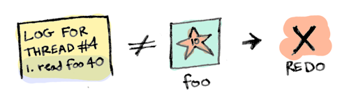
既然我们使用Haskell，我们能够保证这些块没有副作用，例如，我们一次一次的运行它，并且总能得到正确的结果。
Haskell也有类似的TMVar，TMVar或者有一个值或者是空的。

你可以使用putTMVar放一个值到TMVar中，或者使用takeTMVar从TMVar中获取值。
1. 如果你想要放一个值到TMVar中，并且在那里面已经有东西了，putTMVar会阻塞，直到变空。
2. 如果你试着从TMVar中取出一个值，并且它是空的，takeTMVar会阻塞到里面有东西。
我们的叉子就是TMVar，这有一些跟叉子相关的函数
```
newFork :: Int -> IO Fork
newFork i = newTMVarIO i

takeFork :: Fork -> STM Int
takeFork fork = takeTMVar fork

releaseFork :: Int -> Fork -> STM ()
releaseFork i fork = putTMVar fork i
```
一个哲学家拿起两把叉子：
```
(leftNum, rightNum) <- atomically $ do
  leftNum <- takeFork left
  rightNum <- takeFork right
  return (leftNum, rightNum)
```
他吃了一点
```
putStrLn $ printf "%s got forks %d and %d, now eating" name leftNum rightNum
delay <- randomRIO (1,3)
threadDelay (delay * 1000000)
putStrLn (name ++ " is done eating. Going back to thinking.")
```
然后他将叉子放回去
```
atomically $ do
  releaseFork leftNum left
  releaseFork rightNum right
```
[完整的代码在这里](https://gist.github.com/egonSchiele/5566641)
actor需要你重构你所有的程序。STM使用起来很简单-你只需要指定不可再分的运行哪一部分。Clojure和Haskell都对STM有核心支持。其他的很多语言也有模块支持：C，Python，Scala，Javascript等等。
我会很高兴看到STM被更多的使用。
## 总结
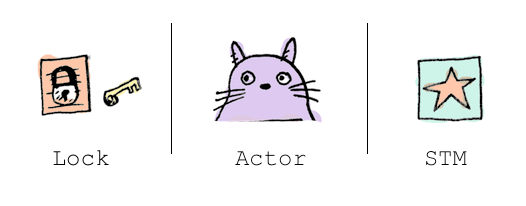
### lock
<ul type="cycle">
    <li>大部分语言都是可用的</li>
    <li>使你对你的代码更好的控制粒度</li>
    <li>使用起来很复杂，你的代码会有死锁/饿死等情况。**你不应该使用锁**</li>
</ul>

### actors
<ul type="cycle">
    <li>没有贡献状态，所以很容易写线程安全的代码</li>
    <li>没有锁。所以没有死锁除了actor阻塞</li>
    <li>你所有的代码都要使用actors和消息传递，所以你可能需要重构你的代码</li>
</ul>

### STM
<ul type="cycle">
    <li>使用简单，不必重构代码</li>
    <li>没有锁，所以不会死锁</li>
    <li>性能好线程很少处于Idle状态</li>
</ul>