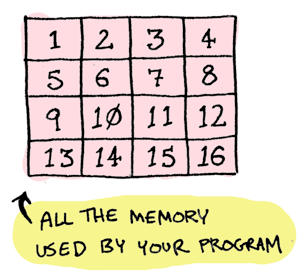
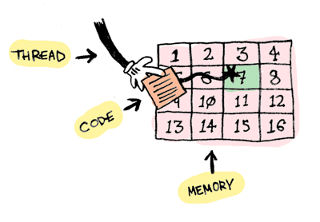
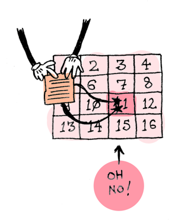
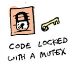

# Locks, Actors, And Stm In Pictures
> 翻译自[这里](http://www.adit.io/posts/2013-05-15-Locks,-Actors,-And-STM-In-Pictures.html)

所有的并发程序都有相同的问题
你的程序使用内存

当你的代码是单线程的，只有一个线程来访问你的内存，这是没问题的。

但是当你的代码是多线程的，它们就会相互改写变化的内容。

你有三种方法来解决这个问题
1. lock
2. actor
3. software transaction memory
我会用这三种方法来解决一个经典的并发问题，并且看一下哪个是最好的.我要解决哲学家吃饭问题。如果你不知道这个问题，来看一下[这部分](http://www.adit.io/posts/2013-05-11-The-Dining-Philosophers-Problem-With-Ron-Swanson.html)。
## lock
如果你的代码访问一块内存，那就把这块内存锁起来。

