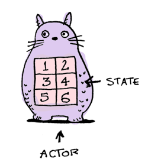

# Locks, Actors, And Stm In Pictures
> 翻译自[这里](http://www.adit.io/posts/2013-05-15-Locks,-Actors,-And-STM-In-Pictures.html)

所有的并发程序都有相同的问题
你的程序使用内存

当你的代码是单线程的，只有一个线程来访问你的内存，这是没问题的。

但是当你的代码是多线程的，它们就会相互改写变化的内容。

你有三种方法来解决这个问题
1. lock
2. actor
3. software transaction memory
我会用这三种方法来解决一个经典的并发问题，并且看一下哪个是最好的.我要解决哲学家吃饭问题。如果你不知道这个问题，来看一下[这部分](http://www.adit.io/posts/2013-05-11-The-Dining-Philosophers-Problem-With-Ron-Swanson.html)。
## lock
如果你的代码访问一块内存，那就把这块内存锁起来。

**mutex** == the lock
**critical section** == the code locked with the mutex
现在，如果有线程想要访问这份代码的话，它必须要有钥匙.所以同一时间只有一个线程可以访问这段代码。

很好，在一个时刻只有一个线程访问某段代码。问题解决了，是吗？


下面是关于[资源继承解决方法](http://www.adit.io/posts/2013-05-11-The-Dining-Philosophers-Problem-With-Ron-Swanson.html#solution-1-resource-hierarchy的Rudy代码的实现。每一个哲学家都有左叉子和右叉子（两个都是mutex）。
```
class Philosopher
    def initialize(name, left_fork, right_fork)
        @name=name
        @left_fork=left_fork
        @right_fork=right_fork
    end
```

现在我们试着获取叉子
```
while true
    @left_fork.lock
    puts "Philosophor #@name has one fork..."
    if @right_fork.try_lock
        break
    else
        puts "Philosopher #@name cannot pickup second fork"
        @left_fork.unlock
    end
end
```
1. 一个哲学家拿起了叉子1.他等着直到他拥有它（'''lock''' 等待）
2. 他试着拿起叉子2，但是他没有等待（'''try_lock''' 不等待）
3. 如果他没有得到叉子2，他放下叉子1并再次尝试
[完整的代码在这](https://gist.github.com/egonSchiele/5565009)。[这里有一份使用服务员的代码实现](https://gist.github.com/egonSchiele/5593864)
锁使用起来很有技巧。如果你使用了锁，做好准备处理各种各样的因为死锁饿死而带来的bug。[这篇文章讨论了所有你可能碰到的问题](http://www.adit.io/posts/2013-05-11-The-Dining-Philosophers-Problem-With-Ron-Swanson.html)

## Actors
我爱actors，你爱actors。Actors是独身且忧郁的。每个actor管理自己的状态。

actors相互之间的请求通过消息传递。

**actors从来不分享状态，所以他们永远也不需要通过竞争锁来获取共享的数据。**如果actor永不阻塞，你永远不会死锁！actors在线程间从不共享，所以只有一个线程能获取这个actor的状态。
当你传递消息给一个actor，这个消息就会进入它的邮箱。actor一次从邮箱里拿出一个消息来读。

对于Rudy，我最喜欢的actor库是[Celluloid](https://github.com/celluloid/celluloid).这里是用Celluloid实现了一个简易的actor.
```
class Dog
    include Celluloid
        @name=name
    end

    def get_name
        @name
    end
end
```
看一下```include Celluoid```?这就是它所带来的，将每个```Dog```变成actor.
```
> d = Dog.new
 => #<Celluloid::ActorProxy(Dog:0x3fe988c0d60c)>
> d.set_name "snowy"
 => "snowy"
```
这里我们同步的将actor```d```的名字设为"snowy"。然后我们通过传递消息异步的设置它的名字：
```
d.async.set_name "snoopy"
 => nil
d.get_name
 => "snoopy"

```
相当不错。为了解决哲学家吃饭问题。我们需要使用一个actor来建模共享状态。所以我们引入```Waiter```:
```
class Waiter
  include Celluloid
  FORK_FREE = 0
  FORK_USED = 1

  def initialize(forks)
    @philosophers = []
    @eating = []
    @forks = [FORK_FREE, FORK_FREE, FORK_FREE, FORK_FREE, FORK_FREE]
  end
end
```
这个Waiter掌管着叉子：


当一个哲学家饿了，他通过传送消息告知Waiter：
```
def think
    puts "#{name} is thinking"
    sleep(rand)
    puts "#{name} gets hungry"
    waiter.async.hungry(Actor.current)
end
```
当这个waiter得了消息，他会查看是否有叉子是可用的。
<ul type="cycle">
    <li>如果有可用的叉子，waiter会将他们标记为“in use”，并且给哲学家发送可以吃的消息</li>
    <li>如果没有叉子可用，waiter会告诉哲学家继续思考</li>
</ul>
```
def hungry(philosopher)
    pos=@philosopher.index(philosopher)
    leftpos = pos
    rightpos=(pos+1)%@forks.size
    if @fork[leftpos]==FORKFREE && @forks[rightpos] == FORKFREE
        @forks[leftpos] =FORKUSED
        @eating<<philosopher
        philosopher.aync.eat
    else
        philosopher.asyn.think
    end
end
```
[完整的代码在这里]()。如果你想知道使用锁是怎么做的，[请看这里]().
共享的状态是叉子，只有一个线程在管理这个状态。问题解决了，多谢actors。

## Software Transactional Memory
这一节我要使用Haskell，因为它对STM的实现很好。
STM的使用很简单。就像是数据库中的事物。例如，你通过不可再分的操作拿起两把叉子
```
atomically $ do
    leftFork<- takeFork left
    rightFork<- takeFork right
```
就是这样的，不需要涉及锁和消息传递。这就是STM工作的方式：
1. 你定义一个变量来包含共享状态。在Haskell中这个变量叫做```TVar```：
你可以使用```writeVar```来对这个变量进行写操作，也可以使用```readTVar```来对这个变量进行写操作。一个事物处理写和读操作```TVar```
1. 当一个事物正在一个线程中运行，Haskell只为这个线程创建一个事物日志
2. 