# The Dining Philosophers Problem With Ron Swanson
翻译自[这里](http://www.adit.io/posts/2013-05-11-The-Dining-Philosophers-Problem-With-Ron-Swanson.html)
>把你有的培根和鸡蛋都给我 - Plato
哲学家吃饭问题是一个使用同步来解决的经典的并发问题。来，让我告诉你们它是怎么做的。

五个哲学家坐在一张桌子的周围
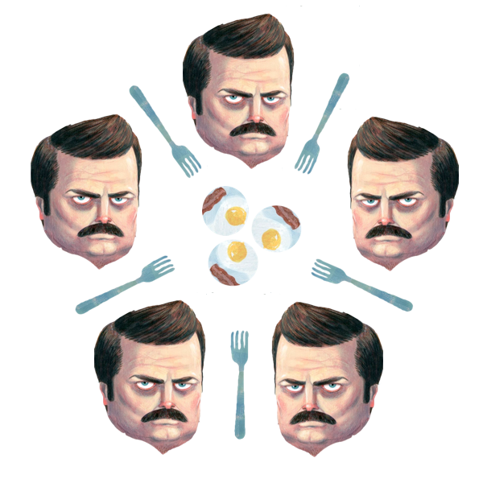
现在，每个哲学家都有两把叉子：左叉子和右叉子。如果一个Swanson得到两把叉子，他就能吃。
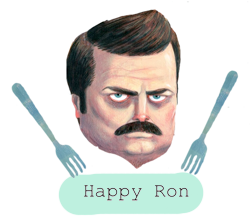
如果只有一把叉子，他就不能吃:(
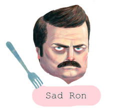
所以Swanson一家需要学会分享叉子
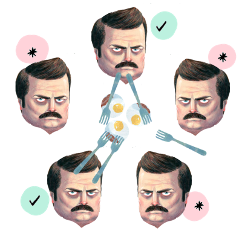
哲学家吃饭的问题在于：**你怎么才能使每一个Swanson都吃到东西？**
## Deadlock（死锁）
不要说我提供了错误的情况。我爱Swanson一家。但是，该死的，他们处于竞争关系。一旦我说开始吃，每一个Swanson都会抓取一把叉子：
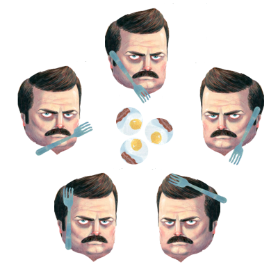
然后他们等着某个人放弃自己的叉子，使得他们能够吃。“Swanson从不放弃自己的叉子！”哎，他们会永远的等着，最终饿死在这个愚蠢的小木屋中。干得不错，伙计们。当所有的Swanson处于困境时，就是deadlock（死锁）。
## Livelock
好吧，Rons。我来设定一个时限，如果在十分钟之内你没有等到叉子的话，你就要放弃叉子。然后等10分钟后再尝试拿起一把叉子。在那时，有人会完成，你就能够使用叉子了：
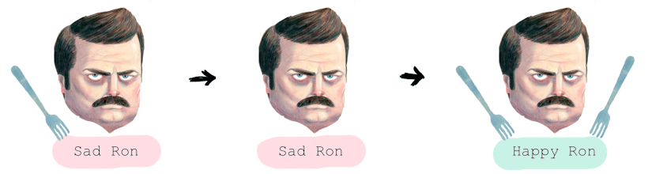
现在就没有deadlock了。但是如果所有的Swanson都在同样的时间在同样的事情。是的，现在是livelock状态，没有什么会出错！是真的么？
30分钟后
我不绕弯子了...
1. 你们全部在同样的时间拿起你们的叉子
2. 10分钟后，你们都放下了你们的叉子
3. 10分钟后，你们都又拿起可你们的叉子！
这会永远进行的

这下该怎么办，兄弟？Swanson都会被饿死的。
## Resource Hierarchy
让我们来给这些叉子编号
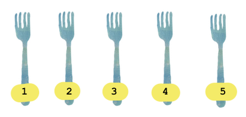
现在的规则是：如果你使用两把叉子，你需要首先拿起编号较小的那一把。让我们看一下现在会发生什么
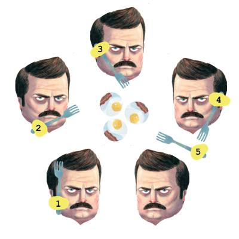
Ron #1 拿起了fork #1
Ron #2 拿起了fork #2
Ron #3 拿起了fork #3
Ron #4 拿起了fork #4
Ron #5 不能拿起fork #5!因为他需要两把叉子，要先拿一把编号较小的。
所以 Ron #4拿起了fork #5---没有死锁
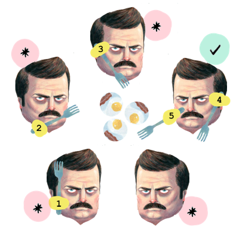
很好。resource hierarchy避免了deadlock。但是速度比较慢。假设你有fork #3和fork #5.然后你决定你需要fork #2.好的，fork #3和fork #5是编号较大的叉子。所以你不得不
1. 放下 fork#5 
2. 放下 fork#3（你放下的顺序并不重要）
3. 拿起 fork#2
4. 拿起 fork#3
5. 拿起 fork#5
额，这好浪费时间的

## Semaphores
这里有一个比较简单的解决方法：如果有5把叉子，只有4个Swanson被允许坐在桌子旁。我们找一个服务员来控制坐到桌子旁边的人：
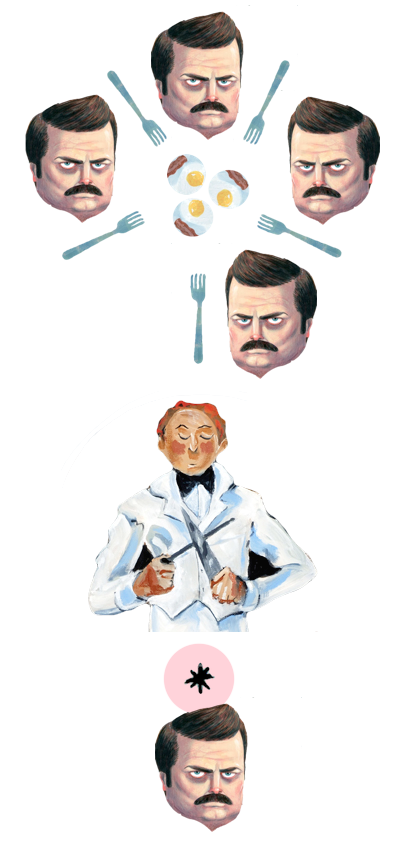
如果少于4个Swanson坐在桌子旁，你就能加入进来。否则你就只能等着，直到桌子胖少于4个Swanson！
OK，这解决了deadlock，但是这仍然存在饿死的状态...某个Swanson可能需要永远的等着，没有机会坐到桌子旁。除非他杀死坐在桌子旁的另一个Swanson。
## Chandy/Misra
所有的叉子或者是干净的，或者是脏的
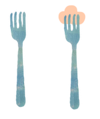
将所有的叉子都初始化为脏的
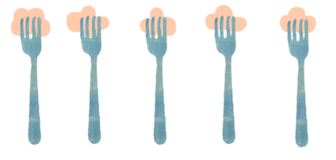
现在：
1. 编号所有的Swanson
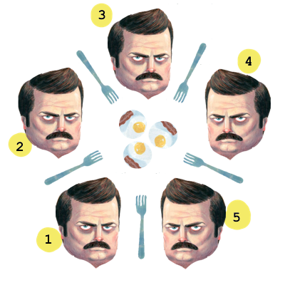
2. 对于每相邻的两个Swanson，将叉子给那个较小编号的人：
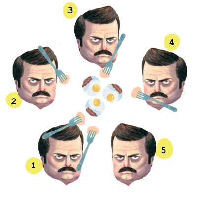
3. 当一个Swanson需要一把叉子，他向他的邻居要叉子。当他的邻居满足下列要求：
如果他的叉子是**干净的**，他就保留叉子。
如果他的叉子是**脏的**，他清洗干净，然后将叉子送出
当一个Swanson吃完，他所有的叉子都变成**脏的**。
**Bam!**饿死的问题解决了！将要饿死的人比正在吃的人有更高的优先级。
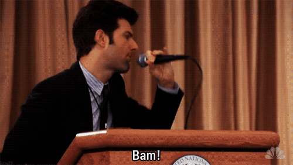